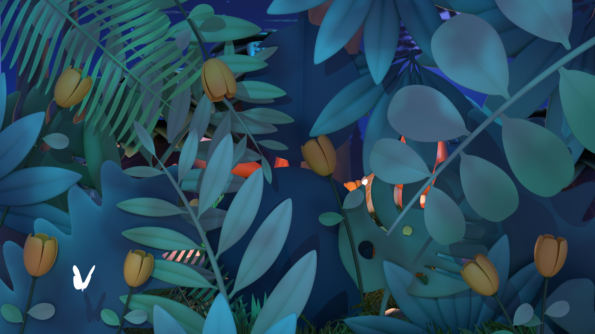
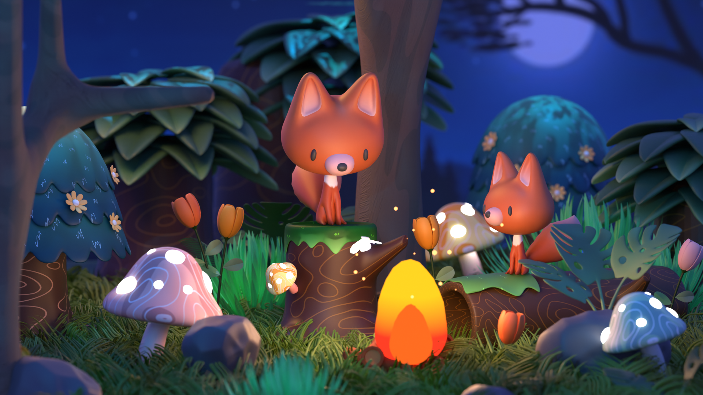
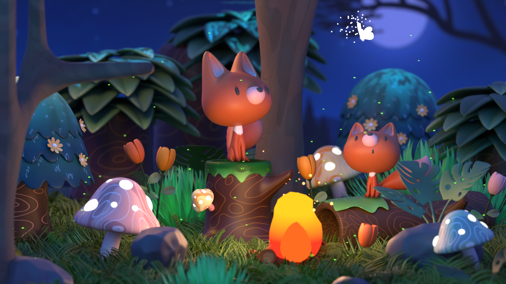

# 20s 2D-Style Animated Short - Blender 

 
 
 
## 📌 Overview  
A stylized 20-second cartoon animation demonstrating core Blender skills, including modeling, rigging, particle systems, and scene animation. Designed to mimic 2D aesthetics while leveraging 3D tools.  

## ✨ Features  
- **Modeling**: Hand-drawn-style assets with optimized topology  
- **Animation**: Shape keys, basic rigging, and head tracking  
- **Effects**: Particle systems (fireflies, embers, hair-based grass)  
- **Lighting**: Dynamic scene lighting with emissive materials    

## 🛠️ Technical Skills Applied  
- **Rendering**: Cycles and Eevee with post-processing  
- **Texturing**: Procedural nodes (Mix, Gradient, Noise)    

## 📚 Learning Resources & Credits  
This project was developed with guidance from:  
 [Blender Tutorial For Beginners] by [Kurtips](https://www.youtube.com/watch?v=HM7TbsnZviM&list=PLWnbm0Hd_z4TNF18poVGNUVszKP74sdcJ)

